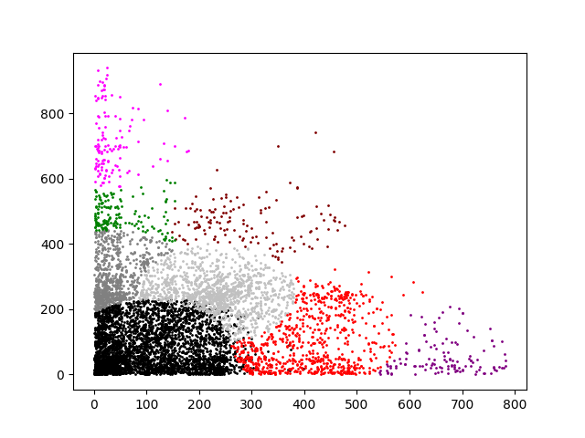

Forel clustering is implemented and the results on the given dataset look like the following.

For different r-s the metrics of comparison were the following

Model  &nbsp;&nbsp;&nbsp;&nbsp;&nbsp;&nbsp;silhouette_score&nbsp;&nbsp;&nbsp;&nbsp;&nbsp;&nbsp;calinski_harabasz_score&nbsp;&nbsp;&nbsp;&nbsp;&nbsp;&nbsp;davies_bouldin_score
 
Forel with r=20.0&nbsp;&nbsp;&nbsp;&nbsp;&nbsp;&nbsp;0.102299&nbsp;&nbsp;&nbsp;&nbsp;&nbsp;&nbsp;5694.220408&nbsp;&nbsp;&nbsp;&nbsp;&nbsp;&nbsp;0.521682

 Forel with r=40.0&nbsp;&nbsp;&nbsp;&nbsp;&nbsp;&nbsp;0.076095&nbsp;&nbsp;&nbsp;&nbsp;&nbsp;&nbsp;3599.862658&nbsp;&nbsp;&nbsp;&nbsp;&nbsp;&nbsp;0.627281

 Forel with r=60.0&nbsp;&nbsp;&nbsp;&nbsp;&nbsp;&nbsp;0.183872&nbsp;&nbsp;&nbsp;&nbsp;&nbsp;&nbsp;3363.241837&nbsp;&nbsp;&nbsp;&nbsp;&nbsp;&nbsp;0.641038

 Forel with r=80.0&nbsp;&nbsp;&nbsp;&nbsp;&nbsp;&nbsp;0.139307&nbsp;&nbsp;&nbsp;&nbsp;&nbsp;&nbsp;3051.150246&nbsp;&nbsp;&nbsp;&nbsp;&nbsp;&nbsp;0.684973

Forel with r=100.0&nbsp;&nbsp;&nbsp;&nbsp;&nbsp;&nbsp;0.113693&nbsp;&nbsp;&nbsp;&nbsp;&nbsp;&nbsp;2599.359635&nbsp;&nbsp;&nbsp;&nbsp;&nbsp;&nbsp;0.673088

Forel with r=120.0&nbsp;&nbsp;&nbsp;&nbsp;&nbsp;&nbsp;0.160725&nbsp;&nbsp;&nbsp;&nbsp;&nbsp;&nbsp;2385.082961&nbsp;&nbsp;&nbsp;&nbsp;&nbsp;&nbsp;0.720445

Forel with r=140.0&nbsp;&nbsp;&nbsp;&nbsp;&nbsp;&nbsp;0.304478&nbsp;&nbsp;&nbsp;&nbsp;&nbsp;&nbsp;2068.262097&nbsp;&nbsp;&nbsp;&nbsp;&nbsp;&nbsp;0.674829

Forel with r=160.0&nbsp;&nbsp;&nbsp;&nbsp;&nbsp;&nbsp;0.286983&nbsp;&nbsp;&nbsp;&nbsp;&nbsp;&nbsp;1728.048376&nbsp;&nbsp;&nbsp;&nbsp;&nbsp;&nbsp;0.743756

Forel with r=180.0&nbsp;&nbsp;&nbsp;&nbsp;&nbsp;&nbsp;0.250871&nbsp;&nbsp;&nbsp;&nbsp;&nbsp;&nbsp;1697.788197&nbsp;&nbsp;&nbsp;&nbsp;&nbsp;&nbsp;0.709376

Forel with r=200.0&nbsp;&nbsp;&nbsp;&nbsp;&nbsp;&nbsp;0.319446&nbsp;&nbsp;&nbsp;&nbsp;&nbsp;&nbsp;1590.898121&nbsp;&nbsp;&nbsp;&nbsp;&nbsp;&nbsp;0.738876

Forel with r=220.0&nbsp;&nbsp;&nbsp;&nbsp;&nbsp;&nbsp;0.364744&nbsp;&nbsp;&nbsp;&nbsp;&nbsp;&nbsp;1941.227554&nbsp;&nbsp;&nbsp;&nbsp;&nbsp;&nbsp;0.716302

Forel with r=240.0&nbsp;&nbsp;&nbsp;&nbsp;&nbsp;&nbsp;0.371649&nbsp;&nbsp;&nbsp;&nbsp;&nbsp;&nbsp;2034.012540&nbsp;&nbsp;&nbsp;&nbsp;&nbsp;&nbsp;0.740571

Forel with r=260.0&nbsp;&nbsp;&nbsp;&nbsp;&nbsp;&nbsp;0.398017&nbsp;&nbsp;&nbsp;&nbsp;&nbsp;&nbsp;1970.838870&nbsp;&nbsp;&nbsp;&nbsp;&nbsp;&nbsp;0.751276

Forel with r=280.0&nbsp;&nbsp;&nbsp;&nbsp;&nbsp;&nbsp;0.412373&nbsp;&nbsp;&nbsp;&nbsp;&nbsp;&nbsp;1772.668796&nbsp;&nbsp;&nbsp;&nbsp;&nbsp;&nbsp;0.680961

Forel with r=300.0&nbsp;&nbsp;&nbsp;&nbsp;&nbsp;&nbsp;0.433482&nbsp;&nbsp;&nbsp;&nbsp;&nbsp;&nbsp;1736.085463&nbsp;&nbsp;&nbsp;&nbsp;&nbsp;&nbsp;0.753309

Forel with r=320.0&nbsp;&nbsp;&nbsp;&nbsp;&nbsp;&nbsp;0.445440&nbsp;&nbsp;&nbsp;&nbsp;&nbsp;&nbsp;2140.269264&nbsp;&nbsp;&nbsp;&nbsp;&nbsp;&nbsp;0.733037

Forel with r=340.0&nbsp;&nbsp;&nbsp;&nbsp;&nbsp;&nbsp;0.487688&nbsp;&nbsp;&nbsp;&nbsp;&nbsp;&nbsp;1772.229521&nbsp;&nbsp;&nbsp;&nbsp;&nbsp;&nbsp;0.667652

Forel with r=360.0&nbsp;&nbsp;&nbsp;&nbsp;&nbsp;&nbsp;0.515565&nbsp;&nbsp;&nbsp;&nbsp;&nbsp;&nbsp;1728.114222&nbsp;&nbsp;&nbsp;&nbsp;&nbsp;&nbsp;0.567807

Forel with r=380.0&nbsp;&nbsp;&nbsp;&nbsp;&nbsp;&nbsp;0.526499&nbsp;&nbsp;&nbsp;&nbsp;&nbsp;&nbsp;1875.083891&nbsp;&nbsp;&nbsp;&nbsp;&nbsp;&nbsp;0.581511

Forel with r=400.0&nbsp;&nbsp;&nbsp;&nbsp;&nbsp;&nbsp;0.544506&nbsp;&nbsp;&nbsp;&nbsp;&nbsp;&nbsp;2486.225831&nbsp;&nbsp;&nbsp;&nbsp;&nbsp;&nbsp;0.616803
